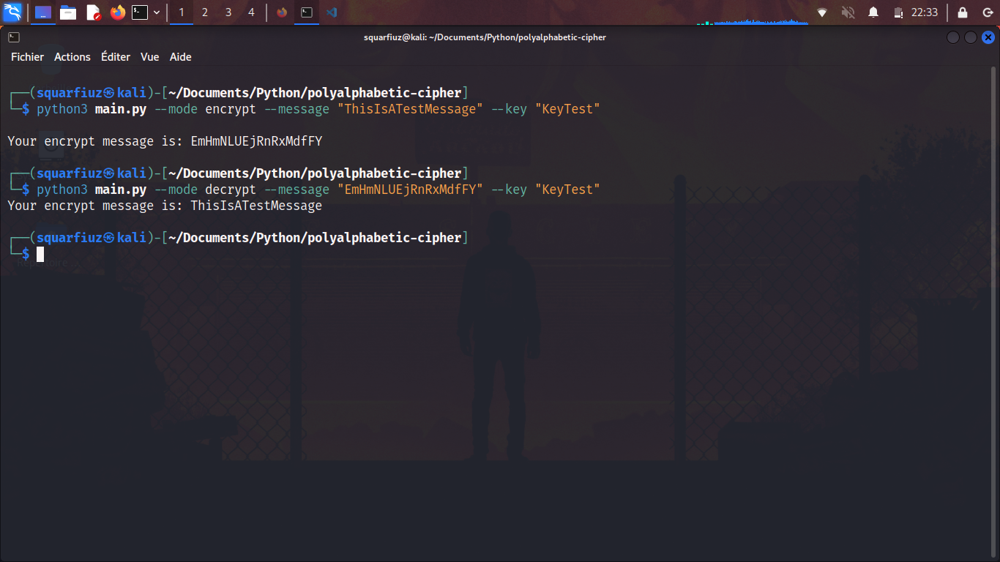

# Polyalphabetic Cipher

## How to use?

Type `python main.py` to run the program.

### Options:
`--mode`: The mode of the program to be executed.\
`--message`: The message to encrypt/decrypt (a-z A-Z).\
`--key`: The key to encrypt/descrypt the message (a-z A-Z).

