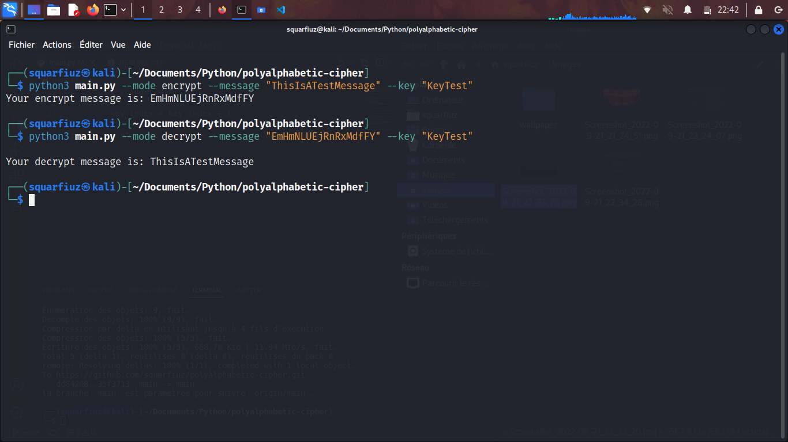

# Polyalphabetic Cipher

## How to use?

Type `python main.py` to run the program.

First enter whether you want to encrypt or decrypt a message by typing `encrypt` or `decrypt`.

Then enter the message to be encrypted/decrypted.

Finally give the key that will allow you to encrypt/decrypt the message.

The program will give you the new encrypted/decrypted word.

